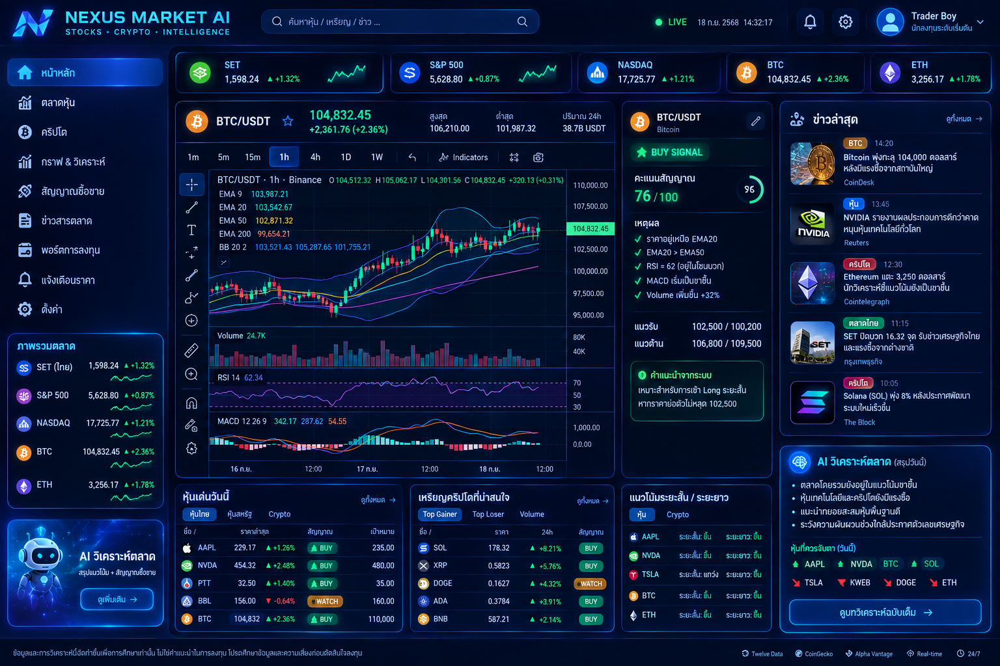

# ⚡ NEXUS MARKET AI
### STOCKS • CRYPTO • INTELLIGENCE

แพลตฟอร์มวิเคราะห์ตลาดหุ้น คริปโตเคอร์เรนซี และสัญญาณซื้อขายทางเทคนิคด้วย AI อัจฉริยะ พร้อมหน้าจอแดชบอร์ดระดับ Financial Terminal ออกแบบตามมาตรฐาน Full-Stack รองรับการรันทั้งบนเครื่อง Local และ Deploy บน **Oracle Cloud Infrastructure (OCI)** (ทั้ง AMD64 และ Ampere ARM64)



---

## 🌟 ฟีเจอร์หลัก (Key Features)

1. **Dashboard & Market Overview**
   * กราฟแนวโน้มดัชนีและสินทรัพย์ชั้นนำ (SET, S&P 500, NASDAQ, BTC, ETH) พร้อม Sparkline แสดงการเปลี่ยนแปลงแบบ Real-time
2. **Trading Chart ระดับโปร (Lightweight Candlestick Chart)**
   * แสดงแท่งเทียน OHLC, Volume และสลับ Timeframe ได้ (1m, 5m, 15m, 1h, 4h, 1D, 1W)
   * คำนวณเส้นค่าเฉลี่ยทางเทคนิค: **EMA 9, EMA 20, EMA 50, EMA 200, Bollinger Bands**
   * หน้าต่างย่อย (Sub-panes) สำหรับ **RSI 14** และ **MACD (12, 26, 9)** พร้อม Histogram
3. **Signal Engine (ระบบคำนวณสัญญาณซื้อขาย)**
   * ให้คะแนนความแข็งแกร่งของสัญญาณ (0–100) และสถานะ: `BUY SIGNAL`, `SELL SIGNAL`, `WATCH`, `NEUTRAL`
   * สรุปเหตุผลทางเทคนิค (เช่น ราคาเหนือ EMA20, RSI Bullish, Volume พุ่ง)
   * ประเมินกรอบแนวรับ-แนวต้าน (Support & Resistance) พร้อมคำแนะนำเชิงกลยุทธ์
4. **AI Market Analysis (บทวิเคราะห์ตลาดโดย AI)**
   * สรุปภาพรวมตลาด ปัจจัยบวก ปัจจัยลบ และปัจจัยเสี่ยง (รองรับ Google Gemini API และ Local AI Engine)
5. **Market News (ข่าวสารตลาดการเงิน)**
   * ฟีดข่าวพร้อมแท็กหมวดหมู่ (BTC, หุ้น, คริปโต, ตลาดไทย) และวิเคราะห์ความรู้สึกของข่าว (Sentiment: Positive / Neutral)
6. **Portfolio & Price Alerts**
   * ระบบจำลองการติดตามพอร์ตการลงทุน (คำนวณกำไร/ขาดทุน P/L และ P/L %)
   * ระบบตั้งเตือนราคาเป้าหมาย (Price Alerts) เมื่อราคาขึ้นหรือลงแตะระดับที่กำหนด

---

## 🛠 เทคโนโลยีที่ใช้ (Tech Stack)

* **Frontend:** React 18, TypeScript, Vite, Tailwind CSS, Lucide Icons
* **Backend:** Node.js, Express, TypeScript, RESTful API
* **Technical Engine:** Custom Math Engine for EMA, SMA, RSI, MACD, Bollinger Bands, Support/Resistance
* **Database & ORM:** PostgreSQL, Prisma ORM
* **Cache:** Redis
* **Container & Proxy:** Docker, Docker Compose, Nginx

---

## 🚀 วิธีรันบนเครื่อง Local (Local Development)

### 1. ติดตั้ง Dependencies
```bash
# Backend
cd backend
npm install

# Frontend
cd ../frontend
npm install
```

### 2. รันโหมด Development
เปิด 2 Terminal:
```bash
# Terminal 1 (Backend - Port 3000)
cd backend
npm run dev

# Terminal 2 (Frontend - Port 5173)
cd frontend
npm run dev
```
เปิดเบราว์เซอร์ไปที่: `http://localhost:5173`

### 3. รัน Unit Tests (ตรวจสอบความถูกต้องของสูตรคำนวณทางเทคนิค)
```bash
cd backend
npm test
```

---

## ☁️ วิธี Deploy บน Oracle Cloud Infrastructure (OCI)

### ขั้นตอนที่ 1: เตรียม OCI Compute Instance
1. สร้าง VM บน Oracle Cloud (Ubuntu 22.04 หรือ 24.04, รองรับทั้ง AMD x86_64 และ Ampere ARM64)
2. ตรวจสอบใน VCN Security List ว่าได้เปิด Ingress Rules สำหรับ **Port 80 (HTTP)**, **443 (HTTPS)** และ **22 (SSH)**

### ขั้นตอนที่ 2: ติดตั้ง Docker & เครื่องมือบน VM
```bash
# อัปเดตแพ็กเกจระบบ
sudo apt update -y && sudo apt install -y curl git ufw iptables-persistent netfilter-persistent

# เปิด Firewall พอร์ต 80 และ 443 บน Ubuntu
sudo iptables -I INPUT 5 -p tcp --dport 80 -j ACCEPT
sudo iptables -I INPUT 6 -p tcp --dport 443 -j ACCEPT
sudo iptables -I INPUT 7 -p tcp --dport 3000 -j ACCEPT
sudo netfilter-persistent save

# ติดตั้ง Docker และ Docker Compose
curl -fsSL https://get.docker.com | sh
sudo usermod -aG docker ubuntu
```

### ขั้นตอนที่ 3: Clone และ Deploy โปรเจกต์
```bash
git clone https://github.com/boynaa1122-ui/Ai-web.git
cd Ai-web

# สร้างไฟล์ .env จากตัวอย่าง
cp .env.example .env

# สั่ง Build และรันด้วย Docker Compose
docker compose up -d --build
```

### ขั้นตอนที่ 4: ตรวจสอบสถานะการทำงาน
```bash
docker compose ps
docker compose logs -f
```
เปิดเบราว์เซอร์ไปที่: `http://<YOUR_OCI_PUBLIC_IP>` จะพบกับหน้าเว็บ NEXUS MARKET AI ทันที!

---

## ⚠️ คำเตือนความเสี่ยง (Disclaimer)
> ข้อมูลและการวิเคราะห์บนระบบนี้จัดทำขึ้นเพื่อการศึกษาและการวิเคราะห์ทางสถิติเท่านั้น **ไม่ใช่คำแนะนำหรือการชักชวนให้ลงทุน** การลงทุนในสินทรัพย์ทางการเงินมีความเสี่ยง ผู้ใช้งานควรศึกษาข้อมูลและใช้วิจารณญาณก่อนตัดสินใจลงทุนทุกครั้ง
